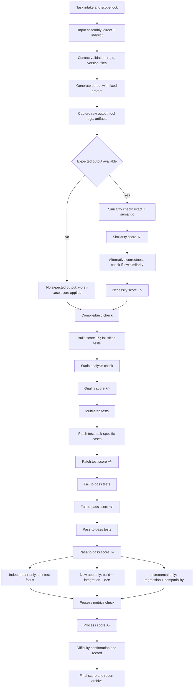

 # Content Generation Evaluation Flow
 

## Detailed Procedure
1. Task intake and scope lock: record task type, repo, version, and acceptance criteria.
2. Input assembly: consolidate direct inputs and required indirect context, then freeze the input set.
3. Context validation: verify file paths, dependencies, and reproducibility constraints.
4. Run generation: execute with a fixed prompt and controlled environment.
5. Evidence capture: store raw outputs, tool logs, and intermediate artifacts.
6. Expected output branch:
   - If expected output exists, run exact and semantic similarity checks and apply similarity score (+/-).
   - If similarity is low, validate whether the output is an acceptable alternative and apply necessity score (+/-).
   - If expected output does not exist, apply worst-case score and continue to the next tests.
7. Build/compile check: apply build score (+/-); failures skip tests.
8. Static analysis check: apply quality score (+/-) by issue thresholds.
9. Multi-step tests:
   - Patch tests: task-specific test cases, apply score (+/-).
   - Fail-to-pass tests: previously failing tests must pass, apply score (+/-).
   - Pass-to-pass tests: regression-free expectation, apply score (+/-).
   - Independent only: unit test focus.
   - New app only: build + integration + end-to-end.
   - Incremental only: regression + compatibility.
10. Process metrics check: token usage, response time, and cost thresholds apply score (+/-).
11. Difficulty confirmation: confirm or adjust difficulty label and log the rationale.
12. Final score and archive: consolidate recorded scores, output decision, and evidence.
