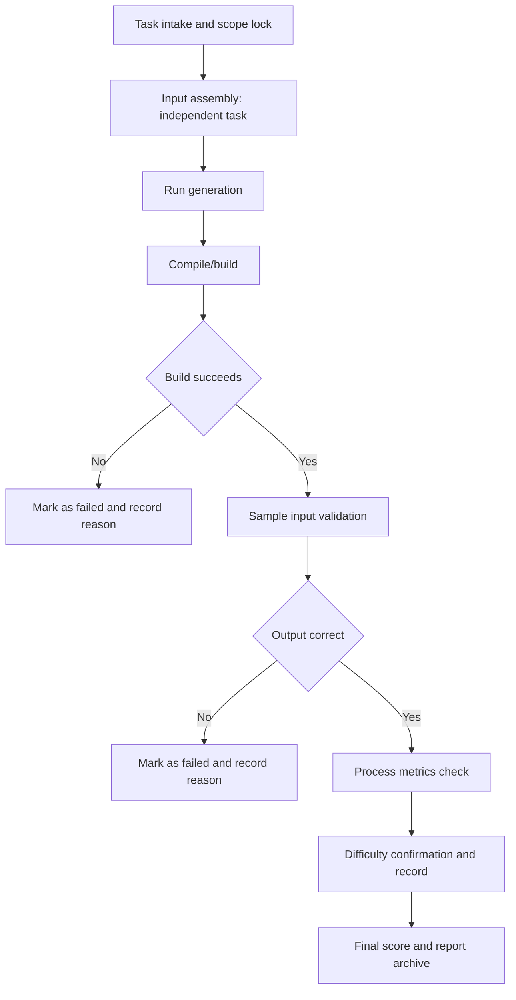

# Independent Generation Evaluation Flow

## Detailed Steps

1. Task intake and scope lock: confirm independent-generation task, freeze scope and acceptance criteria.
2. Input assembly: collect task description, optional sample inputs/outputs, and code skeleton.
3. Run generation: execute the model with fixed prompt and produce code output.
4. Compile/build: directly compile or build the generated code; failure marks the case as failed.
5. Sample input validation: run provided sample inputs and compare with expected outputs; mismatch marks as failed.
6. Process metrics check: record and evaluate response time, token usage, and cost metrics.
7. Difficulty confirmation and record: confirm or adjust difficulty coefficient based on actual completion.
8. Final score and report archive: aggregate scores and archive evidence and results.
