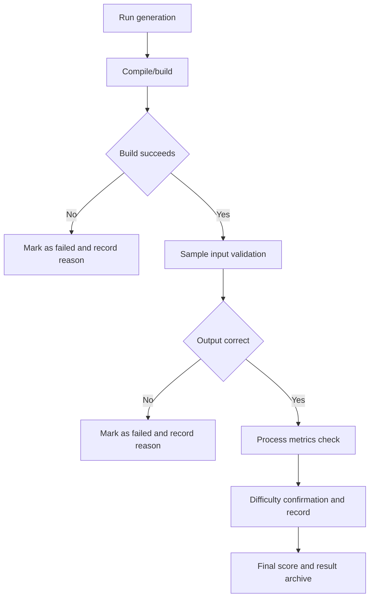

# Independent Generation Evaluation Flow

## Detailed Steps

1. Run generation: execute the model with fixed prompt and produce code output.
2. Compile/build: directly compile or build the generated code; failure marks the case as failed.
3. Sample input validation: run provided sample inputs and compare with expected outputs; mismatch marks as failed.
4. Process metrics check: record and evaluate response time, token usage, and cost metrics.
5. Difficulty confirmation and record: confirm or adjust difficulty coefficient based on actual completion.
6. Final score and result archive: aggregate scores and archive evidence and results.
