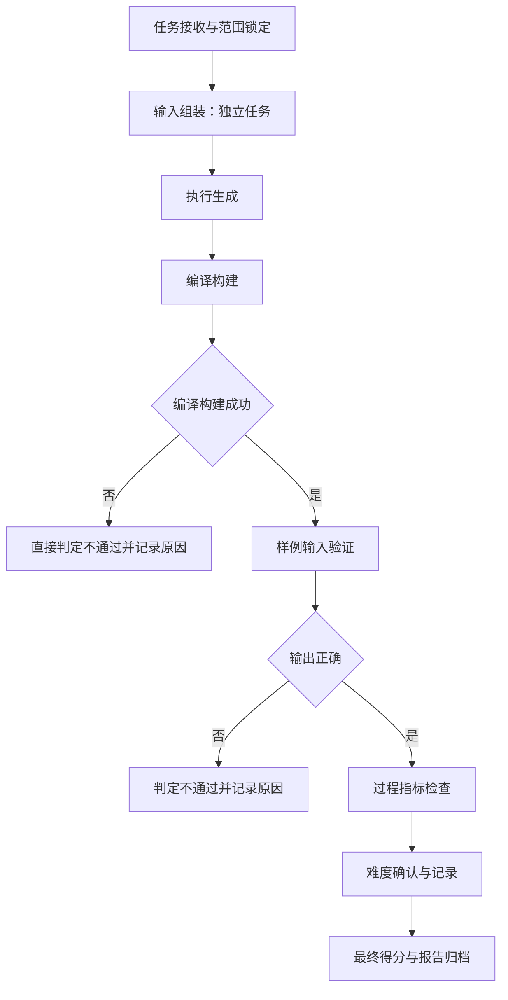

# 生成独立内容测评流程图

## 具体流程

1. 任务接收与范围锁定：确认为独立生成任务，冻结任务范围与验收标准。
2. 输入组装：整理任务描述、可选样例输入/输出与代码框架。
3. 执行生成：以固定提示运行模型，产出代码结果。
4. 编译构建：直接对生成结果编译或构建；失败则标记不通过并记录原因。
5. 样例输入验证：对给定测试输入运行并比对预期输出；不正确则判定不通过。
6. 过程指标检查：记录并评估响应时间、Token 使用量与成本等指标。
7. 难度确认与记录：按实际完成情况确认或修正难度系数。
8. 最终得分与报告归档：汇总分值与结论并归档证据。
