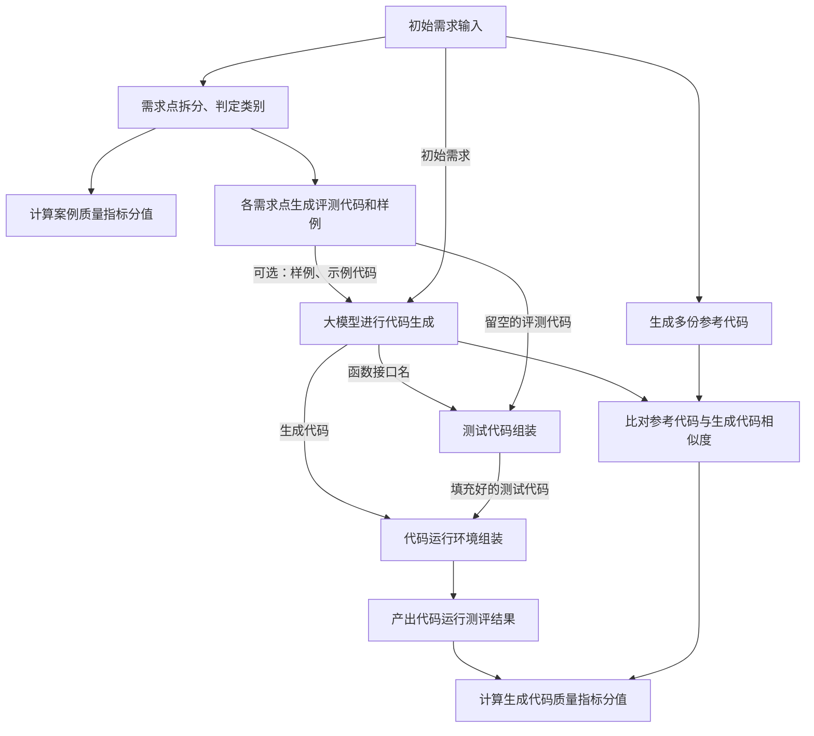

```mermaid
graph TD
    A[初始需求输入]-->C[需求点拆分、判定类别]
    C-->D[计算案例质量指标分值]
    C-->E[各需求点生成评测代码和样例]
    E-->|可选：样例、示例代码| F[大模型进行代码生成]
    A-->|初始需求| F
    F-->|生成代码| G[代码运行环境组装]
    F-->|函数接口名| Fx[测试代码组装]
    E-->|"留空的"评测代码| Fx
    Fx-->|填充好的测试代码| G
    G-->H[产出代码运行测评结果]
    A-->I[生成多份参考代码]
    F-->J[比对参考代码与生成代码相似度]
    I-->J
    H-->K[计算生成代码质量指标分值]
    J-->K
```